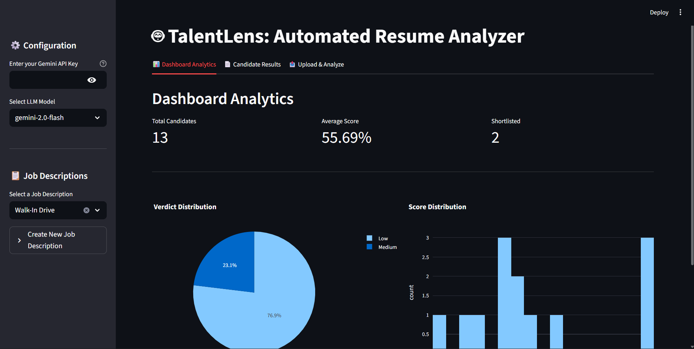
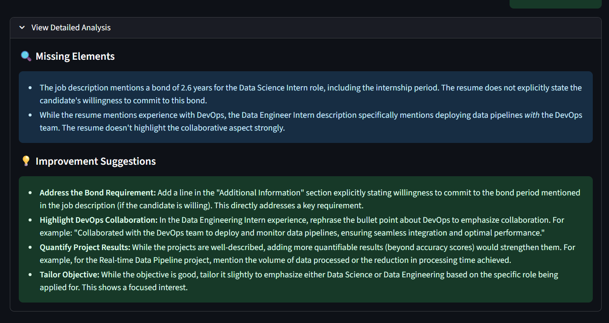
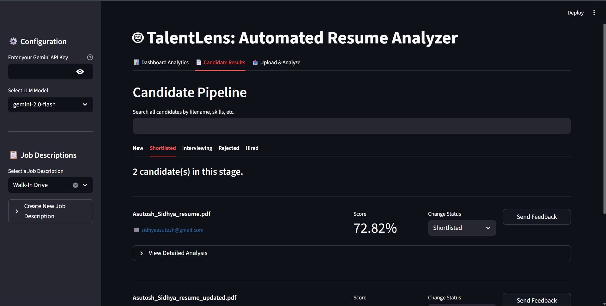
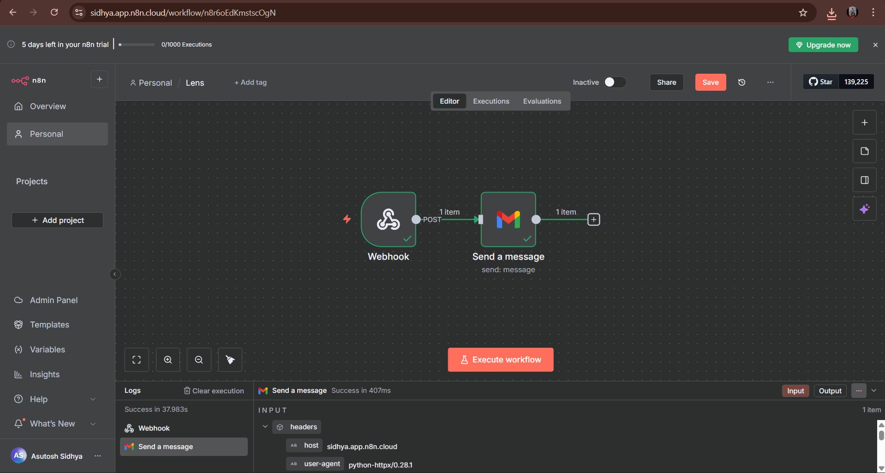
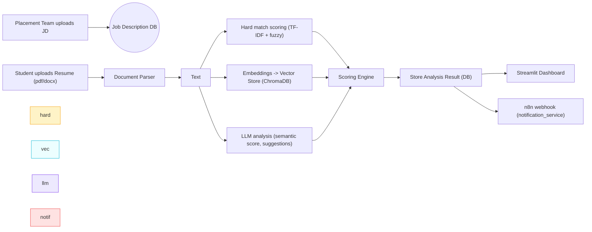
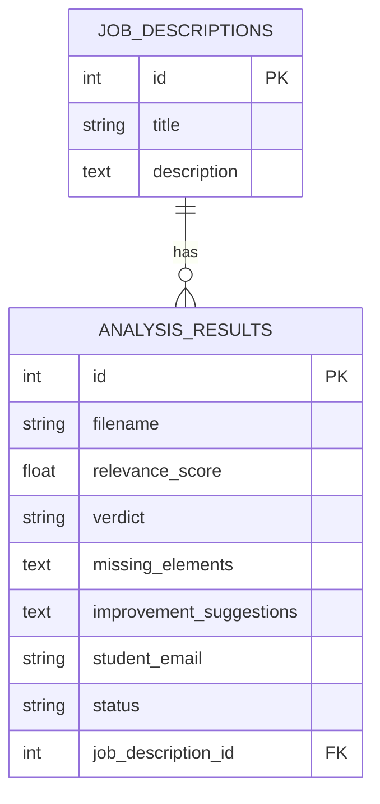

# TalentLens — Automated Resume Relevance Check System 🚀


> An AI-powered, scalable resume evaluation platform that scores candidate resumes against Job Descriptions (JD), highlights gaps, issues fit verdicts, stores results, and sends feedback via n8n / Google Drive integrations.

---

## Table of contents

1. [Project Summary](#project-summary)
2. [Quick Demo & Assets (Screenshots & Video)](#quick-demo--assets-screenshots--video)
3. [Features](#features)
4. [Tech Stack & Architecture (with Mermaid)](#tech-stack--architecture-with-mermaid)
5. [Deep-dive: Code Walkthrough](#deep-dive-code-walkthrough)
6. [API Reference (examples)](#api-reference-examples)
7. [Scoring & Algorithms (detailed)](#scoring--algorithms-detailed)
8. [Running locally & Docker (install / deploy)](#running-locally--docker-install--deploy)
9. [Testing & Example Requests](#testing--example-requests)
10. [Monitoring, Logging & Observability](#monitoring-logging--observability)
11. [Security, Privacy & Compliance](#security-privacy--compliance)
12. [Troubleshooting & Common Pitfalls](#troubleshooting--common-pitfalls)
13. [Roadmap / Improvements](#roadmap--improvements)
14. [Contributing & Contact](#contributing--contact)
15. [References / Files cited (jump-to-code)](#references--files-cited-jump-to-code)

---

## Project summary

**Problem:** recruiters manually screen thousands of resumes for many roles each week — slow, inconsistent, and not scalable.

**Solution:** an automated hybrid system (hard rule checks + LLM semantic analysis) that:

* Accepts resume uploads (PDF/DOCX) and JDs.
* Produces per-resume **Relevance Score (0–100)**, **missing elements**, **verdict** (High/Medium/Low).
* Stores results in DB, supports search/filter via a dashboard.
* Sends feedback via **n8n webhook** and integrates with **Google Drive** for resume selection. &#x20;

---

## Quick demo & assets (screenshots + video)


**Screenshot Section 1 — Dashboard Overview**

* Purpose: show overall metrics (Total candidates, Avg score, Verdict distribution).
* Recommendation: capture `frontend/dashboard.py`'s analytics tab (pie + histogram).&#x20;



**Screenshot Section 2 — Candidate Details / Expanders**


* Purpose: show candidate card with Relevance Score, Missing Elements & Suggestions (the `View Detailed Analysis` expander in Streamlit).&#x20;



**Screenshot Section 3 — Google Drive picker & Upload flow**

* Purpose: show Google login / folder selection / selected resumes list and the Analyze button.&#x20;



**Notification service 4 — n8n Flow**

* Purpose: show Google login / folder selection / selected resumes list and the Analyze button.&#x20;



**Video Section**

* Record a short (60–120s) screen capture showing:

  1. Create JD (sidebar),
  2. Select folder from Google Drive,
  3. Submit 2–3 resumes for analysis,
  4. Show results appearing in Candidate Results.
* Add the YouTube link here: `📺 Demo: https://youtube.com/your-demo`.

---

## Features (at-a-glance)

| Category     | Feature                                                                                   |
| ------------ | ----------------------------------------------------------------------------------------- |
| Core         | Resume upload (PDF/DOCX), JD upload                                                       |
| Scoring      | Hard-match (TF-IDF + fuzzy skill checks), Semantic-match (LLM embeddings + LLM reasoning) |
| Output       | Numeric relevance score (0–100), Missing elements, Improvement suggestions, Verdict       |
| Integrations | ChromaDB (vector store), Google Drive (resume source), n8n webhook (feedback)             |
| UI           | Streamlit dashboard with analytics & candidate viewer                                     |
| Infra        | FastAPI backend, Alembic migrations, Docker Compose                                       |

(Implementation files are listed in the [References](#references--files-cited-jump-to-code).)&#x20;

---

## Tech stack

**Backend**

* FastAPI (API server) — `backend/app/main.py`.&#x20;
* SQLAlchemy + Alembic (DB & migrations).&#x20;
* ChromaDB as vector store (local persistent client).&#x20;
* LLM: Google Gemini via `langchain_google_genai` (pluggable via `X-LLM-Model` header).&#x20;

**Frontend**

* Streamlit dashboard (MVP) — `frontend/dashboard.py`.&#x20;

**Orchestration**

* Docker Compose with services: backend, frontend, chromadb.&#x20;

---

## Architecture (Mermaid flow)



(Implementation: request/analysis flow in `backend/app/api/endpoints/analysis.py`.)&#x20;

---

## Deep-dive: code walkthrough (what’s where)

> Each bullet includes the file that implements it (click the file in your repo to inspect).

### Backend - API & core logic

* **FastAPI entry**: `backend/app/main.py` — initializes app, routers, CORS.&#x20;
* **Analysis endpoint**: `backend/app/api/endpoints/analysis.py` — accepts uploaded resume + JD id, queues background job (BackgroundTasks) to parse, score, store results, and add to vector store. Note: extraction of `student_email` is saved and sending of webhook is implemented in a separate route.&#x20;
* **Jobs & Results endpoints**: `jobs.py` and `results.py` — create JD, list JDs, list results for a JD, update status, and trigger separate send-feedback webhook. &#x20;

### Parsing & NLP

* **Document parsing**: `backend/app/services/document_parser.py` — robust PDF (PyMuPDF) and DOCX extraction. It normalizes textual content for downstream scoring.&#x20;
* **Email extraction & spaCy lazy load**: `scoring_engine.py` contains email extraction (regex) and `get_spacy_model()` helper to lazy-load spaCy.&#x20;

### Scoring engine (core)

* **Hard match**: TF-IDF between JD and resume + fuzzy skill checks (fuzzywuzzy). The hard score is normalized and combined with TF-IDF similarity. The code is in `scoring_engine.py`.&#x20;
* **LLM analysis**: Uses `langchain_google_genai.ChatGoogleGenerativeAI` to produce a structured response (SEMANTIC\_SCORE, MISSING\_ELEMENTS, IMPROVEMENT\_SUGGESTIONS). Parsing is done via regex to extract structured parts.&#x20;
* **Final score & verdict**: Weighted combination — currently `final_score = 0.4 * hard_score + 0.6 * semantic_score`. Verdict: High (>=80), Medium (>=60), Low otherwise.&#x20;

### Vector store

* **ChromaDB wrapper**: `backend/app/services/vector_store.py` — persistent client, adds documents, and implements retries and heartbeat checks. Includes `vector_store` global instance.&#x20;

### Notifications

* **n8n webhook sender**: `backend/app/services/notification_service.py` — async HTTPX client posts an analysis payload to `N8N_WEBHOOK_URL` stored in config. The webhook is used to send feedback to candidate email addresses.&#x20;
* **Config**: `backend/app/core/config.py` holds `N8N_WEBHOOK_URL` and other settings (Google API key placeholder).&#x20;

### DB layer & schemas

* **Models**: `backend/app/database/models.py` — `JobDescription` and `AnalysisResult` (with `student_email`, `status`, foreign key to job\_description).&#x20;
* **CRUD**: `backend/app/database/crud.py` — create/read/query functions used by API endpoints.&#x20;
* **Pydantic schemas**: `backend/app/schemas/models.py` — `AnalysisResponse`, `JobDescriptionCreate`, `StatusUpdate`, etc.&#x20;

### Frontend (Streamlit)

* `frontend/dashboard.py` — Google Drive OAuth flow, resume selection (local/cloud), job description creation, submission to `/api/analyze/`, and analytics (Plotly pie & histogram). Important UI flows: JD sidebar, Google Drive connect, Upload tab, Results and Analytics tabs.&#x20;

### Orchestration & deployments

* `docker-compose.yml` defines `backend`, `frontend`, and `chromadb` (with healthcheck). Use Docker for easy local deployments.&#x20;
* `Docs/suggestion.md` suggests `gunicorn` production CMD for backend.&#x20;

---

## API Reference (concise)

> Base URL (local): `http://localhost:8000/api`

### 1) Submit resume for analysis (background)

`POST /api/analyze/`
Form data:

* `jd_id` (int) — Job description id.
  File:
* `resume` — file upload (pdf/docx).
  Headers:
* `X-API-Key: <GOOGLE_GEMINI_API_KEY>`
* `X-LLM-Model: <model_name>` (example: `gemini-2.0-flash`)

**Response** (immediate): `{"message": "Analysis started in the background for <filename>"}`
(Background task does parsing, scoring, DB save, vector store add.)&#x20;

**Sample cURL**

```bash
curl -X POST "http://localhost:8000/api/analyze/" \
  -H "X-API-Key: $GEMINI_KEY" \
  -H "X-LLM-Model: gemini-2.0-flash" \
  -F "jd_id=1" \
  -F "resume=@/path/to/resume.pdf"
```

### 2) Create JD

`POST /api/jobs/`
Body (JSON): `{ "title": "Senior Python Developer", "description": "..." }` — returns created JD.&#x20;

### 3) List JDs

`GET /api/jobs/` — list job descriptions.&#x20;

### 4) Results for a JD

`GET /api/jobs/{jd_id}/results?search=<term>` — returns list of analysis results (supports `search` by filename/missing/suggestions).&#x20;

### 5) Update result status

`PUT /api/results/{result_id}/status`
Body: `{ "status": "Shortlisted" }` — updates DB status.&#x20;

### 6) Trigger feedback webhook (send to n8n)

`POST /api/results/{result_id}/send-feedback` — server will read stored `student_email` and POST analysis payload to the configured `N8N_WEBHOOK_URL`. (If `student_email` missing, it returns 400.)&#x20;

---

## Scoring & algorithms — deep explanation

**Hard match** (`hard_match_score` in `scoring_engine.py`):

1. Compute TF-IDF vectors for resume and JD; cosine similarity → `tfidf_similarity` (0–1).
2. Check a curated list of JD skills with fuzzy matching (fuzzywuzzy `partial_ratio`) → `fuzzy_normalized`.
3. Combine: `final_score = (tfidf_similarity * 0.7) + (fuzzy_normalized * 0.3)` → scaled to 0–100.&#x20;

**Semantic / LLM analysis** (`llm_analysis`):

* Sends both JD and resume to LLM with a prompt that **returns**:

  * `SEMANTIC_SCORE: <0-100>`
  * `MISSING_ELEMENTS: [list]`
  * `IMPROVEMENT_SUGGESTIONS: [bullet points]`
* The system parses this text via regex and extracts three pieces. This gives `semantic_score`.&#x20;

**Final score & verdict**:

```
final_score = round(0.4 * hard_score + 0.6 * semantic_score, 2)
verdict = "High" if final_score>=80 else "Medium" if >=60 else "Low"
```

You can tune the weights and thresholds in `scoring_engine.py`.&#x20;

**Notes & suggestions**

* Move the **skill list** into DB or JD metadata to make hard matching JD-specific (instead of hardcoded example skills).
* Use `sentence-transformers` for shared embedding pipeline (already in `pyproject.toml`) if you want to compute semantic similarity in-house as well.&#x20;

---

## Running locally

### Prereqs

* Python 3.11+, Docker (optional), Google Gemini API key, Google OAuth credentials for Drive (if using Drive integration), n8n webhook URL for feedback.

### Option A — Local dev (virtualenv)

1. Backend

```bash
cd backend
python -m venv venv
source venv/bin/activate
pip install -r requirements.txt
# Initialize DB (see migration)
alembic revision --autogenerate -m "Initial migration"
alembic upgrade head
uvicorn app.main:app --reload
```

(See `Docs/steps.md` for full step-by-step).&#x20;

2. Frontend

```bash
cd frontend
python -m venv venv
source venv/bin/activate
pip install -r requirements.txt
streamlit run dashboard.py
```

Set `.env` with `GOOGLE_API_KEY` and `N8N_WEBHOOK_URL`.&#x20;

### Option B — Docker Compose (recommended)

```bash
# from repo root
docker-compose build
docker-compose up -d
# inside backend container, run migrations:
docker-compose exec backend alembic revision --autogenerate -m "Initial migration"
docker-compose exec backend alembic upgrade head
```

This boots `backend`, `frontend` (Streamlit), and `chromadb`.&#x20;

**Production note**: Docs/suggestion.md recommends using Gunicorn + Uvicorn workers for production.&#x20;

---

## Testing & quick checks

**Check backend root**

```bash
curl http://localhost:8000/
# -> {"message":"Resume Analysis API is running."}
```

(Implemented in `backend/app/main.py`.)&#x20;

**Submit JD + Resume sample**

```bash
# create JD
curl -X POST http://localhost:8000/api/jobs/ -H "Content-Type: application/json" \
  -d '{"title":"Backend Engineer","description":"Python, FastAPI, Docker"}'
# submit resume
curl -X POST "http://localhost:8000/api/analyze/" \
  -H "X-API-Key: $GEMINI_KEY" -H "X-LLM-Model: gemini-2.0-flash" \
  -F "jd_id=1" -F "resume=@/tmp/sample_resume.pdf"
```

Results appear in DB and via `GET /api/jobs/1/results`.&#x20;

---

## Monitoring / Observability

* Use **LangSmith** / LangGraph for LLM chain observability (packages are in `pyproject.toml`) if you integrate them.&#x20;
* For production logs, run `docker-compose logs -f` or configure a centralized logging sink.&#x20;

---

## Security & privacy (important)

* **API Keys**: Keep `GOOGLE_API_KEY` and other secrets in `.env` or secret manager — do **not** commit to Git. `backend/app/core/config.py` reads `.env`.&#x20;
* **PII**: resumes contain personal data (emails etc). The system extracts `student_email` and stores it in DB (see model `student_email`). Ensure access control and retention policies are implemented.&#x20;
* **Webhook payloads**: the n8n webhook contains personal fields; ensure TLS and proper authentication on the webhook receiver.&#x20;

---

## Troubleshooting & common pitfalls

1. **ChromaDB connection fails** — `vector_store.py` uses PersistentClient and retries; check chroma service is up (Docker healthcheck). Increase attempts or run local chroma.&#x20;
2. **Alembic failure "Path doesn't exist: alembic"** — follow `Docs/migration.md` to `alembic init alembic` and set `target_metadata` in `alembic/env.py`.&#x20;
3. **LLM errors** — ensure `X-API-Key` header is set and valid; llm chain uses `langchain_google_genai.ChatGoogleGenerativeAI`.&#x20;
4. **No email extracted** — regex extraction might miss certain formats; check `extract_email_from_text` in `scoring_engine.py`.&#x20;

---

## Roadmap / future improvements

* Make skill list JD-driven (store must-have/good-to-have fields in JD table).
* Add batch job scheduling & concurrent worker pool (Celery / RQ / FastAPI + BackgroundTask scaling).
* Add more robust resume parsers (OCR for scanned PDFs), NER pipelines (spaCy custom models) and structured resume schema extraction.&#x20;
* Add authentication + RBAC for placement team dashboard.
* Add per-company weighting and automatic re-ranking based on human corrections.

---

## Contribution guide

* Fork → feature branch → PR with tests. Keep secrets out of commits. Describe DB changes and run migrations (`alembic revision --autogenerate`).

---

## Appendix — Mermaid ER diagram (DB)



(DB model files: `backend/app/database/models.py`)&#x20;

---

## References — jump to code (selected)

* `backend/app/api/endpoints/analysis.py` — analysis submission & background job.&#x20;
* `backend/app/services/scoring_engine.py` — scoring & LLM analysis implementation.&#x20;
* `backend/app/services/document_parser.py` — resume parsing (PDF/DOCX).&#x20;
* `backend/app/services/vector_store.py` — ChromaDB wrapper & persistent client.&#x20;
* `backend/app/services/notification_service.py` — webhook sender to n8n.&#x20;
* `backend/app/database/crud.py` — DB CRUD operations.&#x20;
* `backend/app/schemas/models.py` — Pydantic models.&#x20;
* `backend/app/main.py` — FastAPI app setup.&#x20;
* `frontend/dashboard.py` — Streamlit UI & Google Drive integration.&#x20;
* `docker-compose.yml` — service definitions.&#x20;
* `Docs/steps.md` — installation and run steps.&#x20;
* `Docs/migration.md` — alembic init & migration tips.&#x20;

---

## Final notes & immediate tweaks I recommend

1. Move **skill lists** from hardcoded array in `scoring_engine.hard_match_score` to JD metadata so each JD has its own must-have/good-to-have list. (Currently it's an example list in code.)&#x20;
2. Make the LLM prompt result **JSON** instead of a textual template to simplify parsing (or use `StrOutputParser` + stricter format).&#x20;
3. Add tests for `document_parser` with different PDF types and a test harness for `scoring_engine`.
4. Add role-based access + authentication to the Streamlit UI (or replace with React for production UI).

